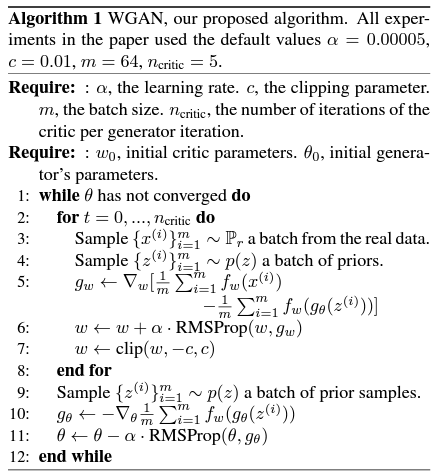
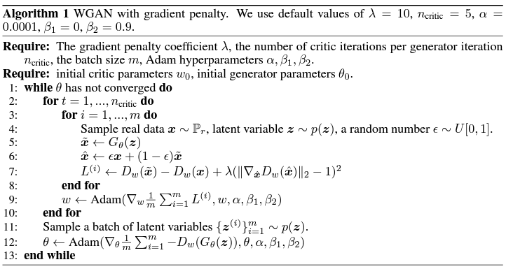
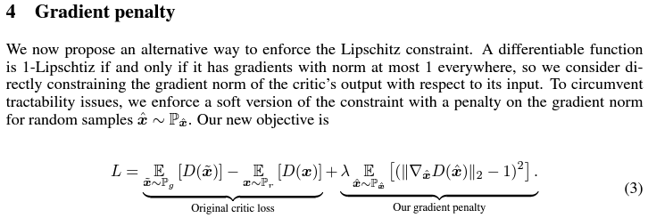
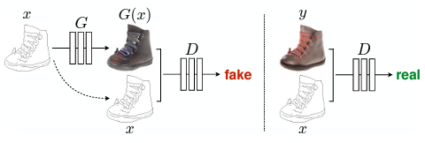
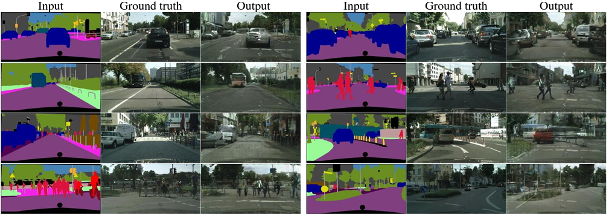
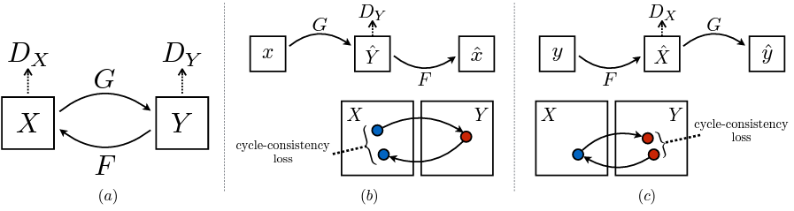
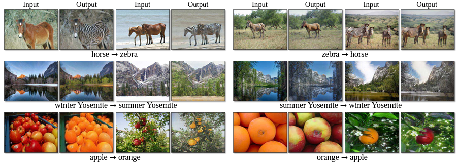

# GAN_package
 Base codes for generative models

### 0. 가장 기본적인 Generative Adversarial Model

### 1. DCGAN: Deep Convolution GAN
- [Radford, A., Metz, L., & Chintala, S. (2015). Unsupervised representation learning with deep convolutional generative adversarial networks. arXiv preprint arXiv:1511.06434.]

### 2. WGAN: Wasserstein GAN
- [Arjovsky, M., Chintala, S., & Bottou, L. (2017, July). Wasserstein generative adversarial networks. In International conference on machine learning (pp. 214-223). PMLR.]

### 3. WGAN-GP: Wasserstein GAN - Gradient Penalty를 이용하여 학습 안정성 높인 버전
- [Gulrajani, I., Ahmed, F., Arjovsky, M., Dumoulin, V., & Courville, A. C. (2017). Improved training of wasserstein gans. Advances in neural information processing systems, 30.]

### 4. Pix2Pix: Style Transfer 하는데 이용되는 구조
- [Isola, P., Zhu, J. Y., Zhou, T., & Efros, A. A. (2017). Image-to-image translation with conditional adversarial networks. In Proceedings of the IEEE conference on computer vision and pattern recognition (pp. 1125-1134).]

### 5. CycleGAN:
- [Zhu, J. Y., Park, T., Isola, P., & Efros, A. A. (2017). Unpaired image-to-image translation using cycle-consistent adversarial networks. In Proceedings of the IEEE international conference on computer vision (pp. 2223-2232).]

