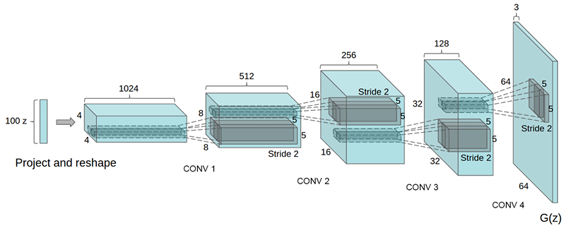

# GAN_package
 Base codes for generative models

### 0. 가장 기본적인 Generative Adversarial Model

### 1. DCGAN: Deep Convolution GAN
- [Radford, A., Metz, L., & Chintala, S. (2015). Unsupervised representation learning with deep convolutional generative adversarial networks. arXiv preprint arXiv:1511.06434.]

### 2. WGAN: Wasserstein GAN

### 3. WGAN-GP: Wasserstein GAN - Gradient Penalty를 이용하여 학습 안정성 높인 버전

### 4. Pix2Pix: Style Transfer 하는데 이용되는 구조

### 5. CycleGAN:
