# GAN_package

PyTorch implementations of generative adversarial networks, from the original GAN to StyleGAN2, covering unconditional image generation, image-to-image translation, a VQGAN autoencoder, and GAN-based anomaly detection for images and time series.
Every model is a self-contained folder built on a small shared library, `gan_common`, which provides datasets, losses, regularizers, layers, logging, and checkpointing.

## Models

| # | Folder | Model | Reference | Task | Default data |
|---|---|---|---|---|---|
| 0 | [`0.Simple_GAN`](0.Simple_GAN) | GAN | Goodfellow et al., NeurIPS 2014 | Generation | MNIST 28px |
| 1 | [`1.DCGAN`](1.DCGAN) | DCGAN | Radford et al., ICLR 2016 | Generation | MNIST 64px |
| 2 | [`2.WGAN`](2.WGAN) | WGAN | Arjovsky et al., ICML 2017 | Generation | MNIST 64px |
| 3 | [`3.WGAN-GP`](3.WGAN-GP) | WGAN-GP | Gulrajani et al., NeurIPS 2017 | Generation | MNIST 64px |
| 4 | [`4.Pix2Pix`](4.Pix2Pix) | Pix2Pix | Isola et al., CVPR 2017 | Paired image-to-image translation | facades |
| 5 | [`5.CycleGAN`](5.CycleGAN) | CycleGAN | Zhu et al., ICCV 2017 | Unpaired image-to-image translation | horse2zebra |
| 6 | [`6.SNGAN`](6.SNGAN) | SNGAN | Miyato et al., ICLR 2018 | Generation | CIFAR-10 32px |
| 7 | [`7.ProGAN`](7.ProGAN) | ProGAN | Karras et al., ICLR 2018 | Generation | CelebA up to 128px |
| 8 | [`8.StyleGAN2`](8.StyleGAN2) | StyleGAN2 | Karras et al., CVPR 2020 | Generation | CelebA 64px |
| 9 | [`9.VQGAN`](9.VQGAN) | VQGAN (first stage) | Esser et al., CVPR 2021 | Discrete image autoencoding | CelebA 128px |
| 10 | [`10.AnoGAN`](10.AnoGAN) | AnoGAN | Schlegl et al., IPMI 2017 | Image anomaly detection | MNIST one-class-out |
| 11 | [`11.GANomaly`](11.GANomaly) | GANomaly | Akcay et al., ACCV 2018 | Image anomaly detection | MNIST one-class-out |
| 12 | [`12.TadGAN`](12.TadGAN) | TadGAN | Geiger et al., IEEE BigData 2020 | Time-series anomaly detection | Synthetic signal |

Study notes on recent adversarial methods (DDGAN, Diffusion-GAN, GigaGAN, ADD, LADD) are in [`docs/recent`](docs/recent/README.md).

## Installation

Linux or WSL2 with a CUDA GPU. Run from the repository root.

```bash
mamba env create -f environment.yml
```

```bash
conda activate gan
```

`environment.yml` creates the `gan` environment (Python 3.11, PyTorch 2.6.0 and torchvision 0.21.0 built for CUDA 12.4, TensorBoard, W&B, matplotlib, pandas) and installs `gan_common` in editable mode.
To use an existing environment that already has PyTorch, install only the shared library:

```bash
pip install -e .
```

## Data

The data root is resolved as `--data_root` → `$DATA_ROOT` → `~/data`. Datasets are not tracked in git.

| Dataset | Used by | Expected layout under the data root | How to obtain |
|---|---|---|---|
| MNIST, Fashion-MNIST | 0–3, 10, 11 | torchvision layout (`MNIST/`, `FashionMNIST/`) | `--download` |
| CIFAR-10 | 6 | `cifar-10-batches-py/` | `--download` |
| CelebA (aligned) | 7, 8, 9 | `celeba/img_align_celeba/*.jpg`, optional `celeba/list_eval_partition.txt` | Manual. With the partition file, train uses split 0 and evaluation uses split 2 |
| Image folder | 0–3, 6–9 | `--dataset folder --data_path <dir>` → `<dir>/<subdir>/*.jpg` (ImageFolder) | Any image set, e.g. FFHQ |
| pix2pix | 4 | `pix2pix/<name>/{train,val,test}/*.jpg`, each image is A and B side by side | `datasets/download_pix2pix_dataset.sh` from junyanz/pytorch-CycleGAN-and-pix2pix |
| CycleGAN | 5 | `cyclegan/<name>/{trainA,trainB,testA,testB}/*.jpg` | `datasets/download_cyclegan_dataset.sh` from the same repository |
| Time series | 12 | CSV `timestamp,value`, optional anomaly CSV `start,end` | `--dataset csv --data_path <csv> --labels_path <csv>` |
| Synthetic | 0–3, 6–9 / 12 | none | `--dataset fake` (torchvision `FakeData`) / `--dataset synthetic` (sine mixture with injected, labeled anomalies) |

## Usage

Scripts import modules from their own folder and write outputs relative to the working directory, so run them from inside the model folder. `python train.py --help` lists every argument with its default.

```bash
cd 1.DCGAN && python train.py --download
```

Each run writes to `runs/<Model>/<run_name or timestamp>/`:

| Path | Content |
|---|---|
| `config.json` | Full argument set. A resumed run adds `config_resume_<time>.json` instead of overwriting it |
| `tb/` | TensorBoard scalars and images (`tensorboard --logdir runs`) |
| `samples/` | Sample grids as PNG |
| `checkpoints/last.pt` | Latest training state, written every `--save_every` epochs or iterations. `--keep_every N` also keeps `ckpt_XXXXXXX.pt` when the index is a multiple of `N` |

Common options: `--device auto|cpu|cuda|cuda:N`, `--seed`, `--num_workers`, `--wandb` (with `--wandb_project`), and `--resume runs/<Model>/<run>/checkpoints/last.pt`, which continues in the original run folder. `--epochs` and `--iters` are totals, not increments.

| Folder | Train | Evaluate / sample |
|---|---|---|
| `0.Simple_GAN` | `python train.py --download` | |
| `1.DCGAN` | `python train.py --download` | |
| `2.WGAN` | `python train.py --download` | |
| `3.WGAN-GP` | `python train.py --download` | |
| `4.Pix2Pix` | `python train.py --run_name facades` | `python test.py --checkpoint runs/Pix2Pix/facades/checkpoints/last.pt` |
| `5.CycleGAN` | `python train.py --run_name h2z` | `python test.py --checkpoint runs/CycleGAN/h2z/checkpoints/last.pt` |
| `6.SNGAN` | `python train.py --download` | |
| `7.ProGAN` | `python train.py` | |
| `8.StyleGAN2` | `python train.py` | `python generate.py --checkpoint <run>/checkpoints/last.pt --truncation 0.7` |
| `9.VQGAN` | `python train.py` | `python reconstruct.py --checkpoint <run>/checkpoints/last.pt` |
| `10.AnoGAN` | `python train.py --download --anomaly_class 0` | `python detect.py --checkpoint <run>/checkpoints/last.pt` |
| `11.GANomaly` | `python train.py --download --anomaly_class 0` | `python evaluate.py --checkpoint <run>/checkpoints/best.pt` |
| `12.TadGAN` | `python train.py --dataset synthetic` | `python detect.py --checkpoint <run>/checkpoints/last.pt` |

A short pipeline check without data, e.g. `python train.py --dataset fake --iters 20 --log_every 5 --sample_every 10`, works for the image-generation folders.

## Shared library: `gan_common`

| Module | Contents |
|---|---|
| `config.py` | `base_parser` (common CLI arguments), `str2bool`, `positive_int`, `nonneg_int` |
| `data.py` | `get_data_root`, `image_transform` (normalize to [-1, 1]), `build_image_dataset` (mnist, fashion_mnist, cifar10, celeba, folder, fake; optional class filter), `build_loader`, `infinite_batches`, `PairedImageDataset`, `UnpairedImageDataset` |
| `losses.py` | `GANLoss(mode)` with `vanilla` (BCE with logits, non-saturating G), `lsgan`, `hinge`, `wgan`; discriminators always output logits |
| `regularizers.py` | `gradient_penalty` (WGAN-GP), `r1_penalty`, `clip_weights_` (WGAN) |
| `layers.py` | `spectral_norm`, `EqualizedConv2d`, `EqualizedLinear`, `PixelNorm`, `MinibatchStdDev` |
| `networks/dcgan.py` | `DCGANGenerator`, `DCGANDiscriminator` with selectable normalization and a `features()` hook (used by 1–3, 10, 11) |
| `networks/image2image.py` | `UnetGenerator`, `ResnetGenerator`, `NLayerDiscriminator` (PatchGAN), `PixelDiscriminator` (used by 4, 5, 9) |
| `weights.py` | `init_weights` (normal, xavier, kaiming, orthogonal) |
| `ema.py` | `EMA` of generator weights |
| `logger.py` | `Logger`: TensorBoard, PNG samples, optional W&B; context manager |
| `checkpoint.py` | `save_checkpoint` (type-checked, atomic), `save_rolling_checkpoint`, `load_checkpoint` (`weights_only=True`) |
| `utils.py` | `seed_everything`, `get_device`, `count_params`, `make_run_dir`, `resolve_run_dir`, `save_config` |
| `viz.py` | `denorm`, `save_grid`, `make_gif` |
| `metrics.py` | NumPy `roc_auc`, `average_precision`, `precision_recall_f1` (label 1 = anomaly) |

## Model notes

Notation: $`x`$ real sample, $`z`$ latent code, $`G`$ generator, $`D`$ discriminator or critic, $`\mathbb{E}`$ expectation over a mini-batch.

### 0. GAN

Two networks play a minimax game: $`D`$ separates real from generated samples and $`G`$ tries to fool it.

```math
\min_G \max_D \; \mathbb{E}_{x \sim p_{\text{data}}}\big[\log D(x)\big] + \mathbb{E}_{z \sim p_z}\big[\log\big(1 - D(G(z))\big)\big]
```

The generator is trained with the non-saturating form, which gives strong gradients early in training:

```math
\mathcal{L}_G = -\,\mathbb{E}_{z \sim p_z}\big[\log D(G(z))\big]
```

Implementation: MLP generator ($`z \in \mathbb{R}^{64}`$ → 256 → 784, tanh) and discriminator (784 → 128 → 1 logit), Adam 3e-4, batch 32, 50 epochs.

### 1. DCGAN

A convolutional GAN with architectural rules that make adversarial training stable: strided convolutions instead of pooling, transposed convolutions in $`G`$, BatchNorm in both networks (except the $`G`$ output and $`D`$ input), ReLU in $`G`$, LeakyReLU(0.2) in $`D`$, and a tanh output.

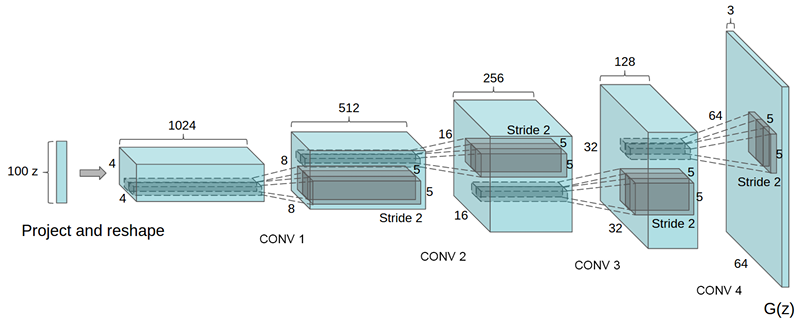

Implementation: $`G`$ channels 1024 → 512 → 256 → 128 → image at 64px, weights initialized from $`\mathcal{N}(0, 0.02)`$, Adam(2e-4, β = (0.5, 0.999)), batch 128, 5 epochs.

### 2. WGAN

The critic $`f`$ estimates the Wasserstein-1 distance through the Kantorovich–Rubinstein duality, which gives useful gradients even when the real and generated distributions do not overlap (where the Jensen–Shannon divergence of the original GAN saturates).

```math
W(P_r, P_g) = \sup_{\lVert f \rVert_L \le 1} \; \mathbb{E}_{x \sim P_r}\big[f(x)\big] - \mathbb{E}_{x \sim P_g}\big[f(x)\big]
```

```math
\mathcal{L}_{C} = \mathbb{E}_{z}\big[f(G(z))\big] - \mathbb{E}_{x}\big[f(x)\big], \qquad
\mathcal{L}_{G} = -\,\mathbb{E}_{z}\big[f(G(z))\big], \qquad
w \leftarrow \mathrm{clip}(w, -c, c)
```

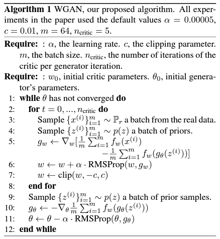

Implementation: weight clipping $`c = 0.01`$ enforces the Lipschitz constraint, 5 critic steps per generator step, RMSprop 5e-5, $`z \in \mathbb{R}^{128}`$.

### 3. WGAN-GP

Replaces weight clipping with a penalty on the critic's gradient norm at points interpolated between real and generated samples.

```math
\mathcal{L}_{C} = \mathbb{E}_{\tilde{x} \sim P_g}\big[D(\tilde{x})\big] - \mathbb{E}_{x \sim P_r}\big[D(x)\big]
+ \lambda \, \mathbb{E}_{\hat{x}}\Big[\big(\lVert \nabla_{\hat{x}} D(\hat{x}) \rVert_2 - 1\big)^2\Big],
\qquad \hat{x} = \epsilon x + (1 - \epsilon)\tilde{x}, \;\; \epsilon \sim U[0, 1]
```

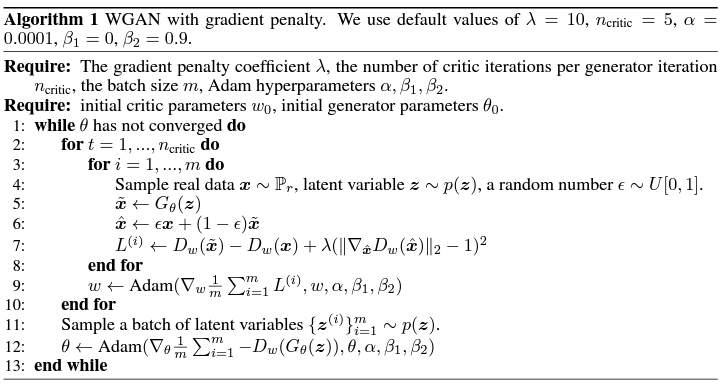

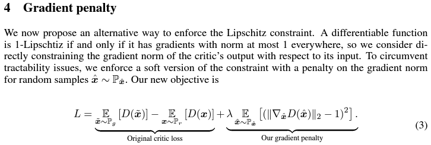

Implementation: $`\lambda = 10`$, InstanceNorm critic (BatchNorm would couple samples inside the per-sample penalty), Adam(1e-4, β = (0, 0.9)), 5 critic steps per generator step.

### 4. Pix2Pix

A conditional GAN for paired translation $`x \to y`$. The discriminator judges $`(x, y)`$ pairs patch by patch, and an L1 term keeps the output close to the target.

```math
G^{*} = \arg\min_G \max_D \; \mathcal{L}_{cGAN}(G, D) + \lambda \, \mathcal{L}_{L1}(G)
```

```math
\mathcal{L}_{cGAN} = \mathbb{E}_{x, y}\big[\log D(x, y)\big] + \mathbb{E}_{x}\big[\log\big(1 - D(x, G(x))\big)\big], \qquad
\mathcal{L}_{L1} = \mathbb{E}_{x, y}\big[\lVert y - G(x) \rVert_1\big]
```

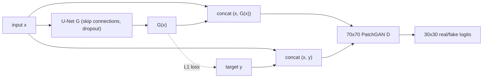
```mermaid
flowchart LR
    X["input x"] --> G["U-Net G (skip connections, dropout)"]
    G --> Y_hat["G(x)"]
    X --> P1["concat (x, G(x))"]
    Y_hat --> P1
    X --> P2["concat (x, y)"]
    Y["target y"] --> P2
    P1 --> D["70x70 PatchGAN D"]
    P2 --> D
    D --> M["30x30 real/fake logits"]
    Y_hat -.->|L1 loss| Y
```

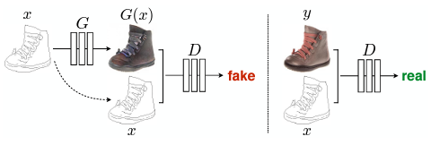

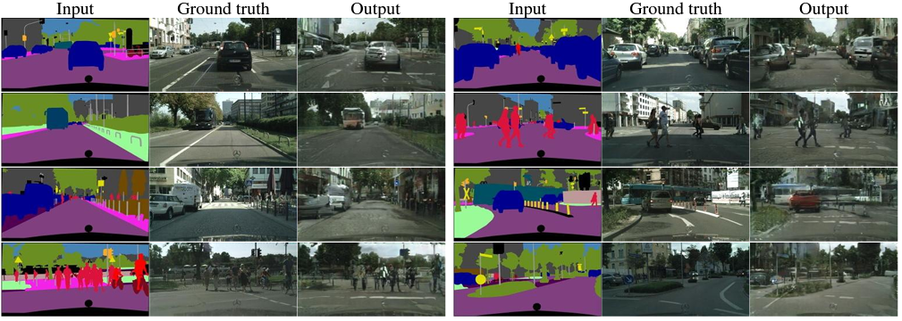

Implementation: U-Net-256 generator, 70×70 PatchGAN, $`\lambda = 100`$, Adam(2e-4, β = (0.5, 0.999)), batch 1, 100 epochs at a constant learning rate followed by 100 epochs of linear decay.

### 5. CycleGAN

Unpaired translation between domains $`X`$ and $`Y`$ with two generators $`G: X \to Y`$, $`F: Y \to X`$ and two discriminators. A cycle-consistency loss requires each translation to be invertible.

```math
\mathcal{L} = \mathcal{L}_{GAN}(G, D_Y) + \mathcal{L}_{GAN}(F, D_X) + \lambda \, \mathcal{L}_{cyc}(G, F) + \lambda_{id} \, \mathcal{L}_{id}(G, F)
```

```math
\mathcal{L}_{cyc} = \mathbb{E}_{x}\big[\lVert F(G(x)) - x \rVert_1\big] + \mathbb{E}_{y}\big[\lVert G(F(y)) - y \rVert_1\big], \qquad
\mathcal{L}_{id} = \mathbb{E}_{y}\big[\lVert G(y) - y \rVert_1\big] + \mathbb{E}_{x}\big[\lVert F(x) - x \rVert_1\big]
```

The adversarial terms use the least-squares form, e.g. $`\mathcal{L}_{GAN}(G, D_Y) = \mathbb{E}_{y}\big[(D_Y(y) - 1)^2\big] + \mathbb{E}_{x}\big[D_Y(G(x))^2\big]`$.

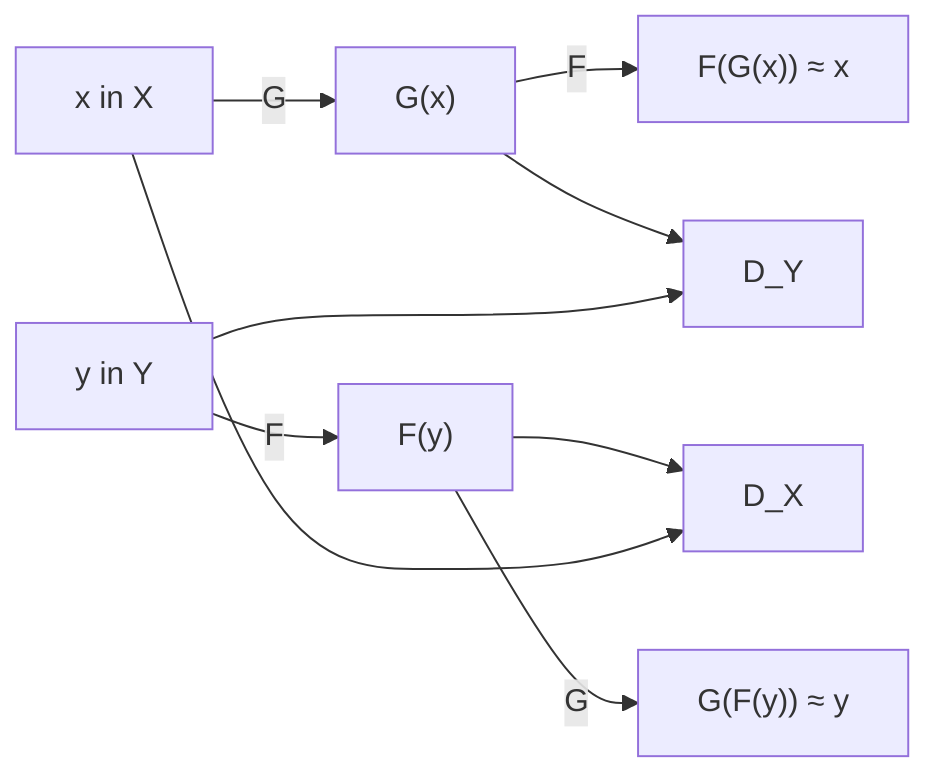
```mermaid
flowchart LR
    x["x in X"] -->|G| gy["G(x)"]
    gy -->|F| x_rec["F(G(x)) ≈ x"]
    y["y in Y"] -->|F| fx["F(y)"]
    fx -->|G| y_rec["G(F(y)) ≈ y"]
    gy --> DY["D_Y"]
    y --> DY
    fx --> DX["D_X"]
    x --> DX
```

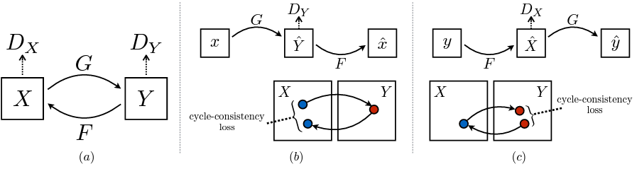

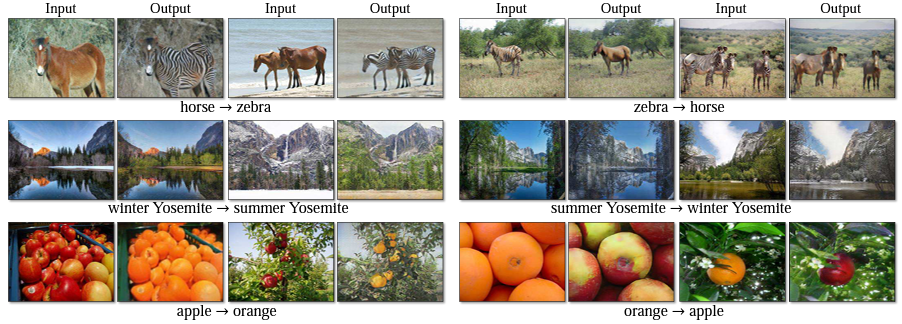

Implementation: in code $`G`$ = `G_AB`, $`F`$ = `G_BA`, $`D_X`$ = `D_A`, $`D_Y`$ = `D_B`. ResNet-9 generators and 70×70 PatchGAN discriminators with instance normalization, $`\lambda = 10`$, $`\lambda_{id} = 0.5\lambda`$, a pool of 50 past generated images for the discriminator updates, and the same learning-rate schedule as Pix2Pix.

### 6. SNGAN

Spectral normalization divides every discriminator weight by its largest singular value, so each layer is 1-Lipschitz without penalties or clipping. The singular value is tracked with one power-iteration step per update.

```math
\bar{W}_{SN} = \frac{W}{\sigma(W)}, \qquad
\tilde{v} \leftarrow \frac{W^{\top}\tilde{u}}{\lVert W^{\top}\tilde{u} \rVert_2}, \quad
\tilde{u} \leftarrow \frac{W\tilde{v}}{\lVert W\tilde{v} \rVert_2}, \quad
\sigma(W) \approx \tilde{u}^{\top} W \tilde{v}
```

Trained with the hinge loss:

```math
\mathcal{L}_D = \mathbb{E}_{x}\big[\max(0, 1 - D(x))\big] + \mathbb{E}_{z}\big[\max(0, 1 + D(G(z)))\big], \qquad
\mathcal{L}_G = -\,\mathbb{E}_{z}\big[D(G(z))\big]
```

Implementation: CIFAR-10 ResNet generator and discriminator, spectral normalization on every discriminator layer, 5 discriminator steps per generator step, Adam(2e-4, β = (0, 0.9)), 50k generator steps with linear learning-rate decay.

### 7. ProGAN

Both networks start at 4×4 and grow by doubling the resolution. Each new block is faded in while the previous output path is faded out.

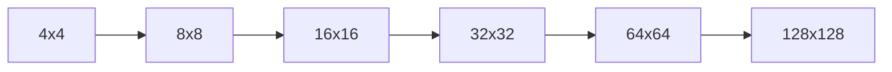
```mermaid
flowchart LR
    R4["4x4"] --> R8["8x8"] --> R16["16x16"] --> R32["32x32"] --> R64["64x64"] --> R128["128x128"]
```

```math
x_{\text{out}} = (1 - \alpha)\, \mathrm{up}\big(\text{toRGB}_{r/2}(h_{r/2})\big) + \alpha \, \text{toRGB}_{r}(h_{r}), \qquad \alpha: 0 \to 1
```

Equalized learning rate rescales weights at runtime, and pixelwise feature normalization replaces BatchNorm in $`G`$:

```math
\hat{w} = w \cdot \sqrt{2 / n_{\text{in}}}, \;\; w \sim \mathcal{N}(0, 1), \qquad
b_{x,y} = \frac{a_{x,y}}{\sqrt{\frac{1}{N}\sum_{j=0}^{N-1} \big(a^{j}_{x,y}\big)^2 + \epsilon}}
```

The critic loss is WGAN-GP plus a drift term $`\epsilon_{\text{drift}}\,\mathbb{E}_{x}\big[D(x)^2\big]`$ with $`\epsilon_{\text{drift}} = 0.001`$, and a minibatch standard-deviation feature is appended in the last critic block.

Implementation: final resolution 128px, 600k real images per fade-in or stabilization phase, per-resolution batch sizes, Adam(1e-3, β = (0, 0.99)) reset at each phase, generator EMA with decay 0.999.

### 8. StyleGAN2

A mapping network turns $`z`$ into an intermediate latent $`w`$. Per-layer styles modulate the convolution weights, and demodulation normalizes them, replacing AdaIN (the source of the droplet artifacts in StyleGAN).

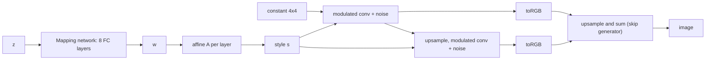
```mermaid
flowchart LR
    Z["z"] --> MAP["Mapping network: 8 FC layers"] --> W["w"]
    W --> A["affine A per layer"] --> S["style s"]
    C["constant 4x4"] --> B1["modulated conv + noise"]
    S --> B1
    B1 --> B2["upsample, modulated conv + noise"]
    S --> B2
    B1 --> RGB1["toRGB"]
    B2 --> RGB2["toRGB"]
    RGB1 --> SUM["upsample and sum (skip generator)"]
    RGB2 --> SUM
    SUM --> IMG["image"]
```

```math
w'_{ijk} = s_i \cdot w_{ijk}, \qquad
w''_{ijk} = \frac{w'_{ijk}}{\sqrt{\sum_{i,k} {w'_{ijk}}^{2} + \epsilon}}
```

Losses: non-saturating logistic loss, lazy R1 regularization on real samples, and path-length regularization, where $`J_w`$ is the Jacobian of the generator with respect to $`w`$ and $`a`$ is a running mean of the path lengths.

```math
\mathcal{L}_D = \mathbb{E}_{z}\big[\mathrm{softplus}(D(G(z)))\big] + \mathbb{E}_{x}\big[\mathrm{softplus}(-D(x))\big] + \frac{\gamma}{2}\,\mathbb{E}_{x}\big[\lVert \nabla_x D(x) \rVert_2^2\big]
```

```math
\mathcal{L}_G = \mathbb{E}_{z}\big[\mathrm{softplus}(-D(G(z)))\big] + w_{pl}\,\mathbb{E}_{w,\, y \sim \mathcal{N}(0, I)}\Big[\big(\lVert J_w^{\top} y \rVert_2 - a\big)^2\Big]
```

Implementation: 64px, batch 16, R1 every 16 steps with $`\gamma = 0.0002 \cdot \text{size}^2 / \text{batch}`$ by default (the StyleGAN2-ADA heuristic), path-length regularization every 4 steps with $`w_{pl} = 2`$, style mixing with probability 0.9, generator EMA, truncation at sampling time. The FIR up/downsampling (`upfirdn2d`) and the fused leaky ReLU are written in plain PyTorch, without custom CUDA kernels.

### 9. VQGAN

The first stage of Taming Transformers: an autoencoder whose latent grid is quantized to the nearest entries of a learned codebook, trained with perceptual and adversarial losses so that a small code grid still decodes to sharp images. The transformer prior over codes (second stage) is not included.

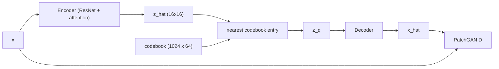
```mermaid
flowchart LR
    X["x"] --> E["Encoder (ResNet + attention)"] --> ZH["z_hat (16x16)"]
    ZH --> Q["nearest codebook entry"] --> ZQ["z_q"]
    CB["codebook (1024 x 64)"] --> Q
    ZQ --> DEC["Decoder"] --> XH["x_hat"]
    XH --> D["PatchGAN D"]
    X --> D
```

```math
z_q = \arg\min_{z_k \in \mathcal{Z}} \lVert \hat{z}_{ij} - z_k \rVert_2
```

```math
\mathcal{L}_{VQ} = \mathcal{L}_{rec}(x, \hat{x}) + \big\lVert \mathrm{sg}[E(x)] - z_q \big\rVert_2^2 + \beta \, \big\lVert \mathrm{sg}[z_q] - E(x) \big\rVert_2^2
```

```math
\mathcal{L} = \mathcal{L}_{VQ} + \lambda \, \mathcal{L}_{GAN}, \qquad
\lambda = \frac{\lVert \nabla_{G_L} \mathcal{L}_{rec} \rVert}{\lVert \nabla_{G_L} \mathcal{L}_{GAN} \rVert + \delta}
```

$`\mathrm{sg}`$ is stop-gradient, gradients pass through the quantizer with the straight-through estimator, and $`\nabla_{G_L}`$ is the gradient at the last decoder layer.

Implementation: $`\mathcal{L}_{rec}`$ = L1 + VGG16 perceptual distance (channel-normalized features, without the learned linear heads of LPIPS), hinge loss for the discriminator, $`\lambda`$ scaled by 0.8 and enabled after 10k iterations, 128px input with downsampling factor 8 (16×16 codes), codebook 1024 × 64, $`\beta = 0.25`$, learning rate 4.5e-6 × batch size.

### 10. AnoGAN

A DCGAN trained only on normal data learns the manifold of normal images. At test time, the latent code that best explains an image is searched by gradient descent; images that cannot be reproduced are anomalous.

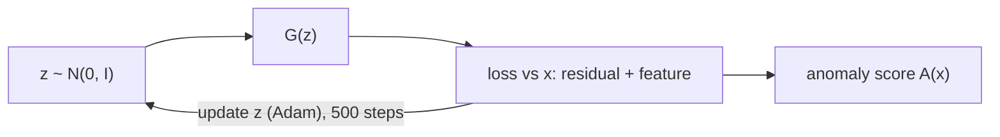
```mermaid
flowchart LR
    Z0["z ~ N(0, I)"] --> GZ["G(z)"]
    GZ --> L["loss vs x: residual + feature"]
    L -->|"update z (Adam), 500 steps"| Z0
    L --> A["anomaly score A(x)"]
```

```math
\mathcal{L}_R(z) = \sum \big\lvert x - G(z) \big\rvert, \qquad
\mathcal{L}_D(z) = \sum \big\lvert f(x) - f(G(z)) \big\rvert
```

```math
z^{*} = \arg\min_z \; (1 - \lambda)\, \mathcal{L}_R(z) + \lambda \, \mathcal{L}_D(z), \qquad
A(x) = (1 - \lambda)\, \mathcal{L}_R(z^{*}) + \lambda \, \mathcal{L}_D(z^{*})
```

$`f`$ is the intermediate feature map of the discriminator, $`\lambda = 0.1`$, and $`z`$ is optimized for 500 Adam steps (learning rate 0.01) with $`G`$ and $`D`$ frozen.

Evaluation protocol (shared with GANomaly): on MNIST, digit `--anomaly_class k` is the anomaly and the other nine digits are normal. Training uses only normal digits from the train split; evaluation uses the full test split. AUROC and average precision are reported, and per-sample scores are written to `scores.csv`.

### 11. GANomaly

An encoder–decoder–encoder generator maps $`x \to z \to \hat{x} \to \hat{z}`$. Trained on normal data only, anomalous inputs are decoded as normal-looking images, so their re-encoded latent $`\hat{z}`$ drifts away from $`z`$. No optimization is needed at test time.

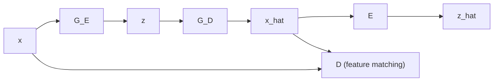
```mermaid
flowchart LR
    X["x"] --> GE["G_E"] --> Z["z"] --> GD["G_D"] --> XH["x_hat"] --> E["E"] --> ZH["z_hat"]
    X --> D["D (feature matching)"]
    XH --> D
```

```math
\mathcal{L}_{adv} = \big\lVert f(x) - f(\hat{x}) \big\rVert_2, \qquad
\mathcal{L}_{con} = \big\lVert x - \hat{x} \big\rVert_1, \qquad
\mathcal{L}_{enc} = \big\lVert z - \hat{z} \big\rVert_2
```

```math
\mathcal{L}_G = w_{adv}\,\mathcal{L}_{adv} + w_{con}\,\mathcal{L}_{con} + w_{enc}\,\mathcal{L}_{enc}, \qquad
(w_{adv}, w_{con}, w_{enc}) = (1, 50, 1), \qquad
A(x) = \frac{1}{d}\big\lVert z - \hat{z} \big\rVert_2^2
```

Scores are min–max scaled over the test set. Implementation: 32px, latent size 100, 15 epochs, the discriminator is re-initialized when its loss falls below 1e-5, and the checkpoint with the best test AUROC is kept as `best.pt` (as in the official code). Differences from the official evaluation protocol are listed in `11.GANomaly/train.py`.

### 12. TadGAN

A GAN over sliding windows of a time series. An encoder $`E`$ and generator $`G`$ (BiLSTMs) learn the cycle $`x \to z \to \hat{x}`$, while two critics judge windows ($`C_x`$) and latents ($`C_z`$).

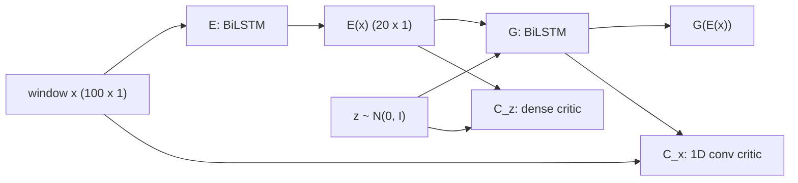
```mermaid
flowchart LR
    X["window x (100 x 1)"] --> E["E: BiLSTM"] --> ZE["E(x) (20 x 1)"]
    ZE --> G["G: BiLSTM"] --> XH["G(E(x))"]
    ZP["z ~ N(0, I)"] --> G
    X --> CX["C_x: 1D conv critic"]
    G --> CX
    ZP --> CZ["C_z: dense critic"]
    ZE --> CZ
```

```math
V_X(C_x, G) = \mathbb{E}_{x}\big[C_x(x)\big] - \mathbb{E}_{z}\big[C_x(G(z))\big], \qquad
V_Z(C_z, E) = \mathbb{E}_{z}\big[C_z(z)\big] - \mathbb{E}_{x}\big[C_z(E(x))\big]
```

```math
\min_{E,\, G} \; \max_{C_x,\, C_z} \; V_X(C_x, G) + V_Z(C_z, E) + \lambda_{rec}\, \mathbb{E}_{x}\big[\lVert x - G(E(x)) \rVert_2^2\big]
```

Both critics use a gradient penalty ($`\lambda_{gp} = 10`$); $`\lambda_{rec} = 10`$, 5 critic steps per encoder–generator step, Adam 5e-4, 35 epochs.

Anomaly scoring (`detect.py`), following the MIT Orion reference implementation:

1. Reconstruct every window and take the per-time-step median over overlapping windows to obtain $`\hat{x}(t)`$.
2. Reconstruction error $`RE(t)`$: dynamic time warping between $`x`$ and $`\hat{x}`$ over a 10-step window (default), or point-wise or area difference.

```math
\mathrm{DTW}(a, b) = \sqrt{\min_{\pi} \sum_{(i, j) \in \pi} (a_i - b_j)^2}
```

3. Standardize both signals, with $`\mu_{IQR}`$ the mean of the critic scores inside the interquartile range:

```math
Z_{RE}(t) = \max\big(0,\, z(RE)(t)\big) + 1, \qquad
Z_{C}(t) = \frac{\lvert C_x(t) - \mu_{IQR} \rvert}{\sigma} + 1
```

4. Combine: $`a(t) = Z_{RE}(t) \cdot Z_{C}(t)`$ (default) or $`a(t) = \alpha \,(Z_{RE}(t) - 1) + (1 - \alpha)(Z_{C}(t) - 1)`$.
5. In sliding windows over $`a(t)`$, flag points above $`\mu + 4\sigma`$, pad and merge them into intervals, and prune intervals whose score is not clearly above the next one.
6. With labeled intervals, report overlapping-segment precision, recall, and F1, plus point-wise metrics.

## References

1. I. Goodfellow et al. Generative Adversarial Nets. NeurIPS 2014.
2. A. Radford, L. Metz, S. Chintala. Unsupervised Representation Learning with Deep Convolutional Generative Adversarial Networks. ICLR 2016. arXiv:1511.06434.
3. M. Arjovsky, S. Chintala, L. Bottou. Wasserstein Generative Adversarial Networks. ICML 2017.
4. I. Gulrajani, F. Ahmed, M. Arjovsky, V. Dumoulin, A. Courville. Improved Training of Wasserstein GANs. NeurIPS 2017.
5. P. Isola, J.-Y. Zhu, T. Zhou, A. A. Efros. Image-to-Image Translation with Conditional Adversarial Networks. CVPR 2017.
6. J.-Y. Zhu, T. Park, P. Isola, A. A. Efros. Unpaired Image-to-Image Translation using Cycle-Consistent Adversarial Networks. ICCV 2017.
7. T. Miyato, T. Kataoka, M. Koyama, Y. Yoshida. Spectral Normalization for Generative Adversarial Networks. ICLR 2018.
8. T. Karras, T. Aila, S. Laine, J. Lehtinen. Progressive Growing of GANs for Improved Quality, Stability, and Variation. ICLR 2018.
9. T. Karras, S. Laine, M. Aittala, J. Hellsten, J. Lehtinen, T. Aila. Analyzing and Improving the Image Quality of StyleGAN. CVPR 2020.
10. P. Esser, R. Rombach, B. Ommer. Taming Transformers for High-Resolution Image Synthesis. CVPR 2021.
11. T. Schlegl, P. Seeböck, S. M. Waldstein, U. Schmidt-Erfurth, G. Langs. Unsupervised Anomaly Detection with Generative Adversarial Networks to Guide Marker Discovery. IPMI 2017.
12. S. Akcay, A. Atapour-Abarghouei, T. P. Breckon. GANomaly: Semi-Supervised Anomaly Detection via Adversarial Training. ACCV 2018.
13. A. Geiger, D. Liu, S. Alnegheimish, A. Cuesta-Infante, K. Veeramachaneni. TadGAN: Time Series Anomaly Detection Using Generative Adversarial Networks. IEEE BigData 2020.
